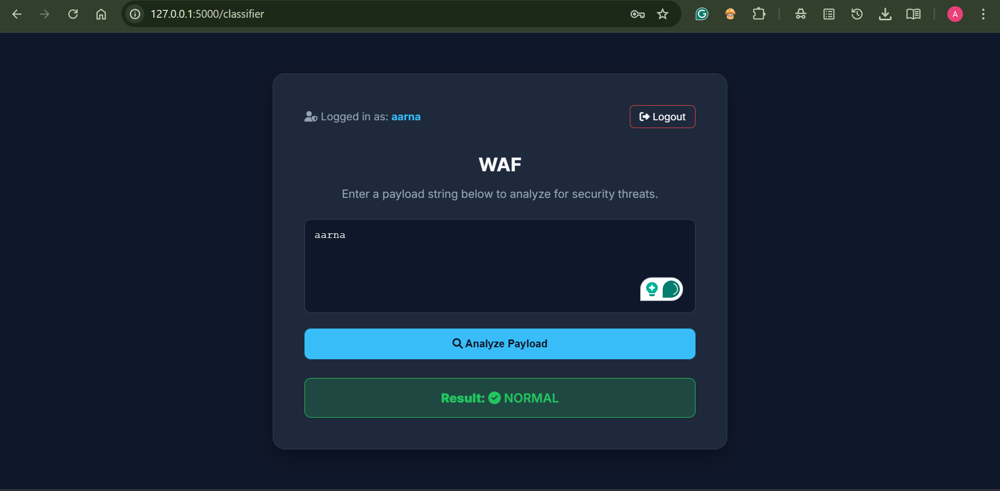
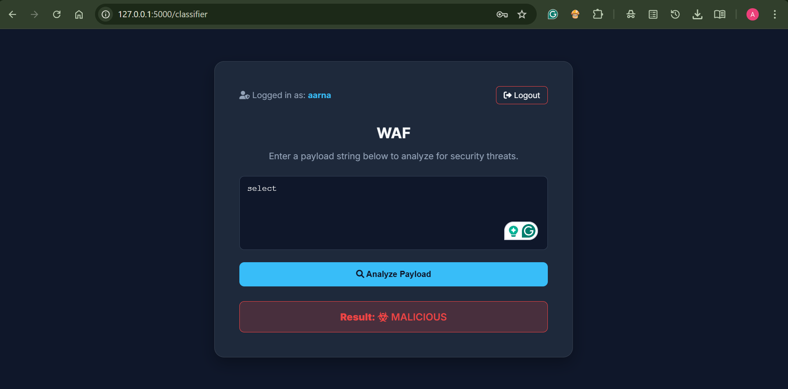

# AI-Powered Web Application Firewall with Semantic Payload Analysis

An intelligent Web Application Firewall (WAF) that uses machine learning to analyze HTTP payloads and detect malicious web requests in real time. The system combines TF-IDF-based feature extraction with supervised machine learning models to classify incoming payloads as benign or malicious and provides a Flask-based interface for authentication, payload analysis, and security event monitoring.

## Overview

Traditional Web Application Firewalls primarily rely on predefined signatures and static rules to detect malicious traffic. While effective against known attack patterns, rule-based systems may struggle with obfuscated payloads and evolving attack techniques.

This project explores a machine-learning-based approach to web application security by analyzing the textual characteristics of HTTP payloads. Incoming payloads are transformed into numerical feature vectors using TF-IDF and classified using trained machine learning models.

The application provides a complete workflow for payload analysis, attack detection, user authentication, security event logging, and deployment using Docker.

## Features

* Real-time analysis of HTTP request payloads
* Machine-learning-based malicious payload classification
* TF-IDF feature extraction for textual payload analysis
* Comparison of Logistic Regression, Random Forest, and XGBoost models
* Detection of malicious web payloads, including SQL injection and cross-site scripting patterns represented in the training dataset
* Flask-based web application and backend
* User authentication
* Security event and prediction logging using SQLite
* Monitoring of analyzed payloads and detected attacks
* Model evaluation using standard classification metrics
* Dockerized application deployment

## System Architecture

The system follows the processing pipeline:

`HTTP Payload → Flask Application → Payload Preprocessing → TF-IDF Vectorization → ML Classifier → Prediction → Security Event Logging`

1. The user or application submits an HTTP payload for analysis.
2. The Flask backend receives and preprocesses the payload.
3. The trained TF-IDF vectorizer transforms the payload into a numerical feature vector.
4. The machine learning classifier predicts whether the payload is benign or malicious.
5. The prediction result is returned by the application.
6. Analysis results and detected security events are stored in the SQLite database for monitoring and review.

## Machine Learning Pipeline

The machine learning pipeline consists of:

* Dataset preprocessing and cleaning
* Payload normalization
* TF-IDF feature extraction
* Training multiple supervised machine learning models
* Evaluation and comparison of model performance
* Selection and serialization of the final model and vectorizer
* Integration of the trained model with the Flask application for inference

### Models Evaluated

* Logistic Regression
* Random Forest
* XGBoost

The trained models were evaluated using metrics such as accuracy, precision, recall, F1-score, and confusion matrices.

The best-performing model achieved approximately **95% classification accuracy** on the evaluation dataset.

## Technology Stack

**Programming Language**

* Python

**Backend**

* Flask

**Machine Learning**

* Scikit-learn
* XGBoost
* TF-IDF

**Database**

* SQLite

**Deployment and Development Tools**

* Docker
* Git
* Linux

## Project Structure

```text
AI-Powered-WAF/
│
├── app/
│   ├── templates/
│   ├── static/
│   ├── routes/
│   └── application files
│
├── models/
│   ├── trained_model
│   └── tfidf_vectorizer
│
├── data/
│   └── dataset files
│
├── notebooks/
│   └── model training and evaluation
│
├── Dockerfile
├── requirements.txt
├── README.md
└── application entry point
```

> Note: Update the project structure above to match the exact files and directories in the repository.

## Installation

### 1. Clone the Repository

```bash
git clone <repository-url>
cd <repository-directory>
```

### 2. Create a Virtual Environment

```bash
python -m venv venv
```

Activate the virtual environment.

**Windows**

```bash
venv\Scripts\activate
```

**Linux/macOS**

```bash
source venv/bin/activate
```

### 3. Install Dependencies

```bash
pip install -r requirements.txt
```

### 4. Run the Application

```bash
python app.py
```

Open the local application address displayed in the terminal.

## Running with Docker

Build the Docker image:

```bash
docker build -t ai-powered-waf .
```

Run the container:

```bash
docker run -p 5000:5000 ai-powered-waf
```

The application will be available on port `5000`.

## Model Evaluation

The machine learning models are evaluated using:

* Accuracy
* Precision
* Recall
* F1-score
* Confusion Matrix

Model comparison helps identify the classifier that provides the best balance between detecting malicious payloads and minimizing false positives.

## Example Payloads

### Benign Payload

```text
username=student&action=view_profile
```

### SQL Injection Payload

```text
username=admin' OR '1'='1' --
```

### Cross-Site Scripting Payload

```text
<script>alert('XSS')</script>
```

The application analyzes the submitted payload and returns a prediction indicating whether it is benign or malicious.

## Security Considerations

This project is intended for cybersecurity research, education, and defensive experimentation.

The machine learning classifier should be treated as an additional security layer rather than a replacement for established web application security controls. Detection performance depends on the quality and representativeness of the training dataset, and previously unseen attack patterns may require retraining or additional detection mechanisms.

## Future Improvements

* Integration with live HTTP traffic through a reverse proxy
* Multi-class attack classification
* Deep learning and transformer-based payload analysis
* Explainable AI for prediction interpretation
* Automated model retraining with newly collected payloads
* REST API support for external applications
* Advanced security analytics dashboard
* Deployment to cloud infrastructure
* Integration with traditional rule-based WAF engines

## Research Publication

The research paper associated with this project is archived on Zenodo.

**DOI:** 

## Authors

**Aarna Aggarwal**
B.Tech Computer Science and Engineering (Cybersecurity)
SRM Institute of Science and Technology

**Devak Bin**
B.Tech Computer Science and Engineering (Cybersecurity)
SRM Institute of Science and Technology

<h2>📸 Screenshots</h2>

<h3>Benign Request Detection</h3>

<p align="center">
  
</p>

<h3>Malicious Request Detection</h3>

<p align="center">
  
</p>

## License

This project is released for academic, research, and educational purposes.

If the associated research publication is released under the Creative Commons Attribution 4.0 International license (CC BY 4.0), note that the publication license does not automatically apply to the software source code. Add a separate software license to this repository if you want others to use, modify, or redistribute the code.

## Disclaimer

This software is intended solely for defensive cybersecurity research and educational purposes. Users are responsible for complying with applicable laws, institutional policies, and authorization requirements when testing or deploying the system.
